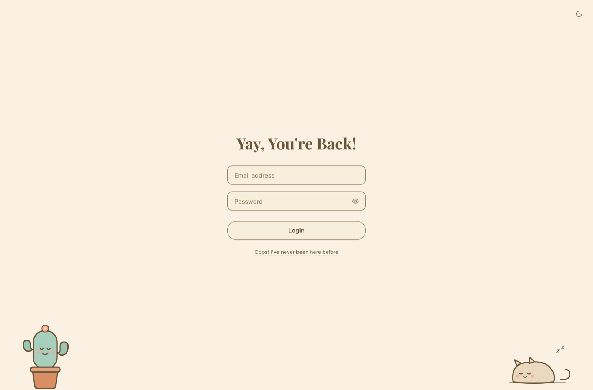
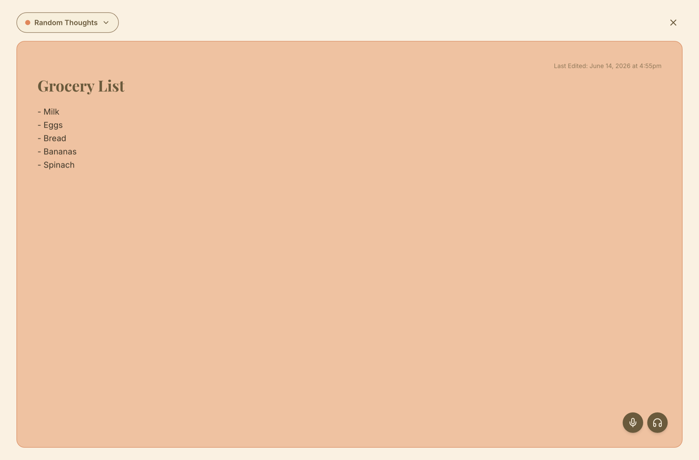
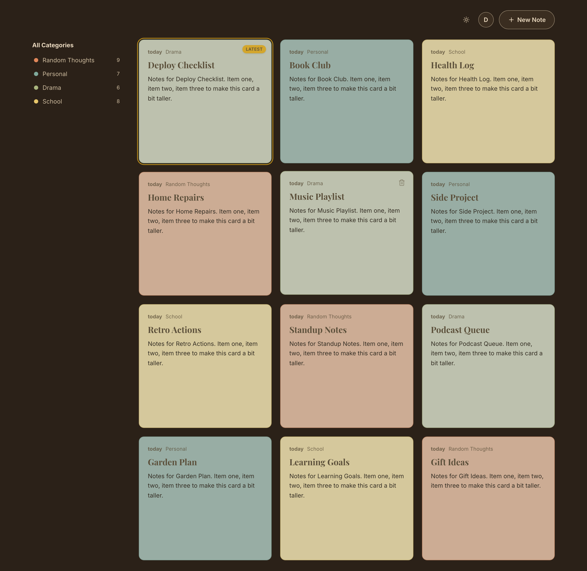
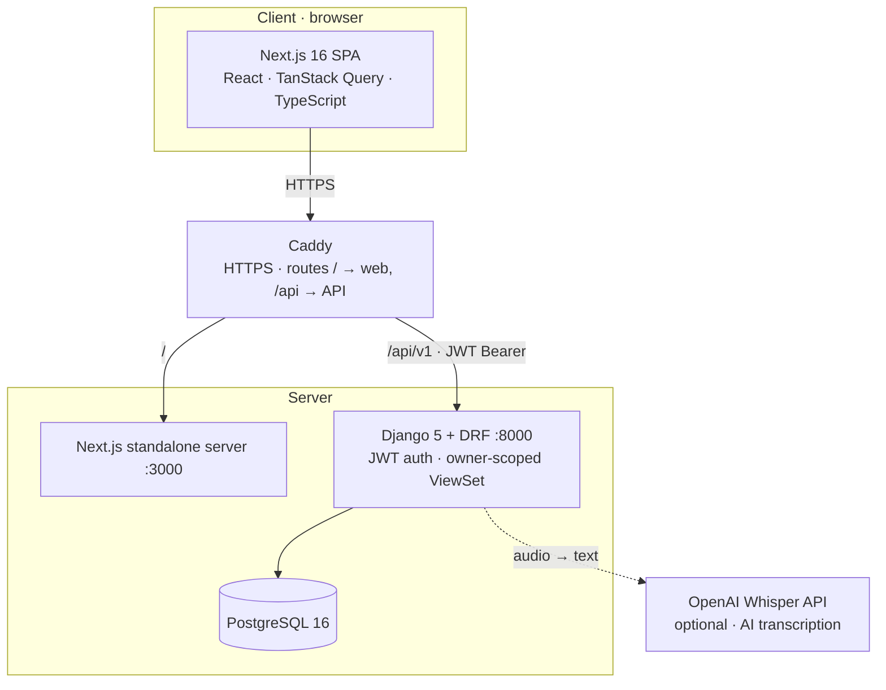
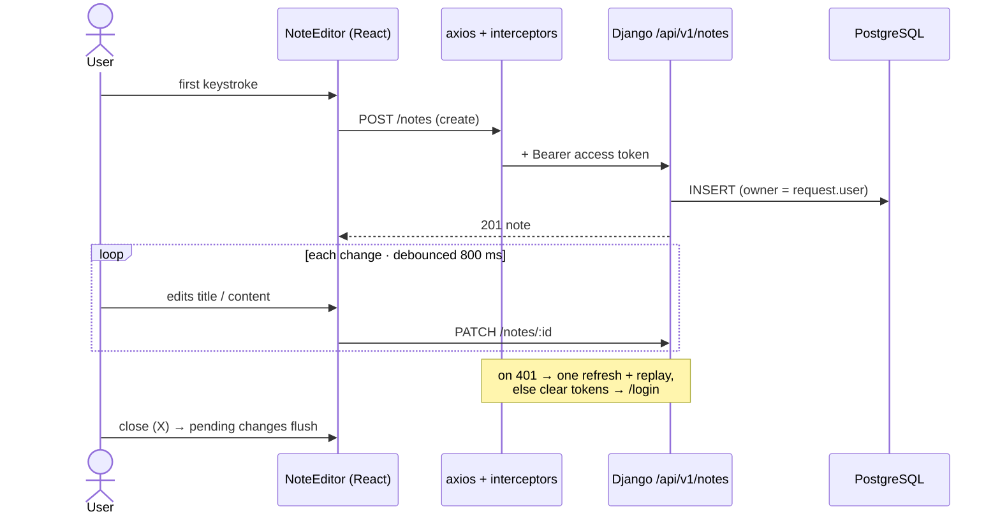
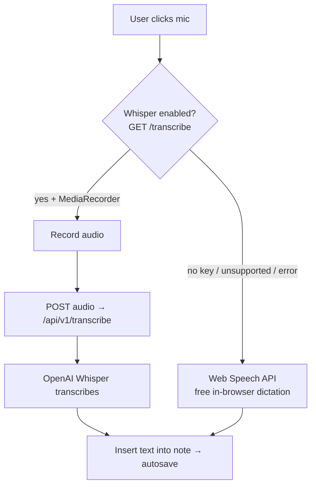
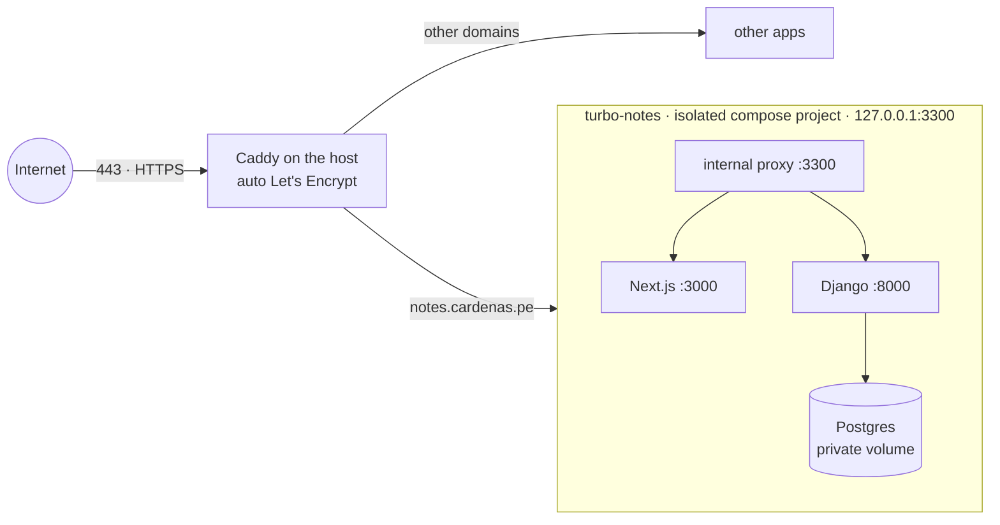
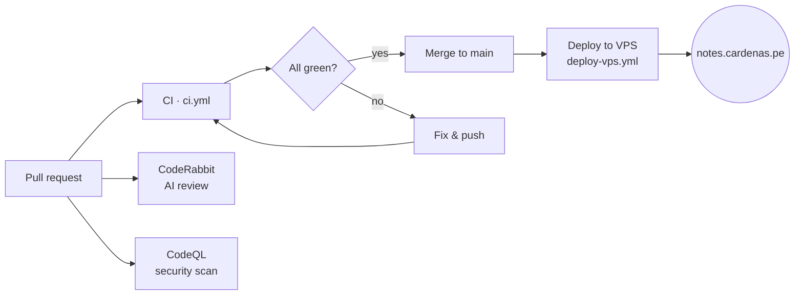

# Turbo Notes

[](https://github.com/unimauro/turbo-notes/actions/workflows/ci.yml)
[](https://github.com/unimauro/turbo-notes/actions/workflows/codeql.yml)
[](https://github.com/unimauro/turbo-notes/actions/workflows/deploy-vps.yml)
[](https://coderabbit.ai)

A production-quality notes application built for the Turbo AI Senior Full Stack Engineer challenge: Django 5 + DRF + PostgreSQL on the backend, Next.js (App Router) + TypeScript + TanStack Query on the frontend, JWT auth, per-user notes with color-coded categories, an autosaving editor — fully dockerized with CI, and styled to match the official prototype video (warm "cozy journal" design: cream paper, serif headings, pastel category cards, original kawaii illustrations).

The guiding principle throughout: **the right amount of engineering for the scope** — clean layering, full test coverage, and documented tradeoffs, without inventing complexity the problem doesn't have.

> **🔴 Live demo:** **[notes.cardenas.pe](https://notes.cardenas.pe)** — sign up, or log in with `demo@turbo.ai` / `demo12345` (backup: `demo2@turbo.ai` / `demo12345`). Each demo account is preloaded with sample notes.
>
> **AI (live):** dictate notes by voice (**OpenAI Whisper**), read them aloud (**TTS**), **suggest a title** / **summarize** with one click, and finish hands-free by saying **"close my note."** Everything degrades gracefully to free in-browser speech when no key is set.

## Features

- **Auth** — email + password sign-up ("Yay, New Friend!") and login ("Yay, You're Back!") backed by JWT (simplejwt): register, token obtain, token refresh. Signup auto-logs-in.
- **Per-user notes** — every note has an owner; all notes endpoints require auth and are scoped to the requesting user (another user's note ids return 404, not 403 — no existence leaking).
- **Categories** — four seeded categories (Random Thoughts · School · Personal · Drama), each note belongs to one; sidebar shows per-user note counts and filters the board (`?category=<id>` on the API).
- **Autosave editor** — fullscreen takeover with **no save button**, matching the prototype: the note is created on the first keystroke, then PATCHed with an 800 ms debounce; pending changes flush on close (X). Changing category instantly recolors the card. Blank titles are allowed end-to-end (drafts exist before titles do).
- **Voice, both ways (AI)** — *dictate* a note by mic (**OpenAI Whisper** when a key is set, else free in-browser Web Speech) and *read it aloud* (**OpenAI TTS**, a soft natural voice, else the browser's). Each path degrades gracefully when no key is configured — see [AI transcription](#ai-transcription-whisper).
- **AI assist** — one click to **suggest a title** or **summarize** a note (OpenAI `gpt-4o-mini`), applied autosave-safely (the summary is non-destructive — shown in a dismissible card with an "Insert" action). Hidden when no key is configured.
- **"close my note" — hands-free voice command** — finish a voice note without touching the keyboard: while dictating, say **"close my note"** (or "save my note"; "turbo close" still works) and the app strips the command from the text, shows a **"Naming your note…"** beat while it auto-titles the note with AI (if the title is empty), **materializes** the new title, then **evaporates** the editor closed. A small tooltip hints it while recording; the X and Escape still work.
- **Security** — rate limiting on auth (10/min) and the paid AI endpoints (20/min), HTTPS + HSTS + secure cookies in prod, owner-scoped access (404 not 403), ORM-only queries with allow-listed filters. Full **[OWASP Top 10](SECURITY.md)** write-up.
- **Admin & observability** — a Django admin back-office (`/admin/`) over users and notes, plus an **auth audit log** (login/register events with IP) and **OpenAI usage tracking** (every transcribe/speak call) — closing the security-logging gap.
- Notes CRUD — list, create, edit, delete (hover trash icon + confirmation)
- Pagination (12 per page, client-tunable up to 100) and ordering (default `-updated_at`)
- `?search=` over title and content remains on the API (the prototype shows no search box, so the UI doesn't render one — see Design fidelity)
- Optimistic updates on create, edit, and delete, with automatic rollback on error
- Full UI states: skeleton loading, empty state (kawaii boba cup: "I'm just here waiting for your charming notes..."), and error with retry
- Dark mode (a bonus beyond the prototype) with no flash-of-wrong-theme; responsive; keyboard accessible
- OpenAPI docs at `/api/docs`, health endpoint at `/api/health`
- One-command startup: `docker compose up --build`

## Screenshots

| Sign in | Board |
| --- | --- |
|  |  |

| Full-screen editor (autosave) | Dark mode |
| --- | --- |
|  |  |

## Architecture

### System at a glance



The backend is **API-first**: a versioned REST API (`/api/v1`) with OpenAPI docs at `/api/docs`. The Next.js client is one consumer of it; a native mobile app could be another without backend changes. SQLite is used for local dev and tests; PostgreSQL in Docker and in production.

### Autosave request flow



### Voice → text (AI with graceful fallback)



The AI feature is never a single point of failure or a forced cost: with no key the endpoint reports `enabled: false` and the UI uses the free browser dictation.

### Production deployment (live at notes.cardenas.pe)

The app runs as a self-contained Docker Compose stack on a server that already hosts other apps, so it is fully isolated — its own project, network and volume, exposed only on a loopback port. A server-wide Caddy fronts every domain and issues TLS automatically.



`docker compose up --build` runs the same stack locally. Kubernetes manifests (`k8s/`) document the horizontal scale-out path but are intentionally not used at this size — see [Scalability](#scalability-considerations).

**Request flow (e.g. autosave):** the user types in the editor → the first change creates the note (`POST /notes/`, category defaulting to Random Thoughts), subsequent changes are debounced 800 ms and PATCHed → the axios request interceptor attaches the access token → DRF authenticates the JWT and the ViewSet's `get_queryset()` scopes everything to `request.user` → on success TanStack Query updates the board cache (and invalidates category counts). If an access token expires mid-session, the response interceptor performs exactly one refresh with the refresh token and replays the original request; if that fails, tokens are cleared and the user lands on `/login`.

**Why a service-less DRF ViewSet is still the right size.** Even with auth and categories, the backend remains thin, idiomatic DRF: ViewSet + serializers + models. Ownership stamping lives in `perform_create`, scoping in `get_queryset`, the default category in the serializer — each rule has exactly one obvious home, and none of them is a multi-step operation with side effects. A service layer here would still be a pass-through. The moment a real cross-cutting rule appears (e.g. "creating a note also indexes it and notifies collaborators"), the seam to introduce one (`perform_create`/`perform_update`) already exists.

The same philosophy applies on the frontend: pages own state wiring, components are presentational, and all data access goes through three layers (`services/` for HTTP, `hooks/` for cache behavior, `types/` for contracts) so the API surface is mockable and components are testable in isolation.

## CI/CD & quality gates

Every change goes through a pull request; nothing reaches production unless the pipeline is green.



**CI gate** (`.github/workflows/ci.yml`, runs on every push and PR to `main`):

| Job | Steps |
| --- | --- |
| **Backend** | `flake8` lint · `black --check` + `isort --check` format · `pytest` with a **coverage floor of 85%** (currently 100%) |
| **Frontend** | `npm run lint` · `npm test` (Jest + React Testing Library) · production `next build` |

**Free quality layers** — three zero-cost services that add review and security without an API key on a public repo:

- **CodeRabbit** (`.coderabbit.yaml`) — AI reviews every PR (summary + line-level suggestions, answers `@coderabbitai` questions). Advisory, never blocks merge on its own.
- **CodeQL** (`.github/workflows/codeql.yml`) — GitHub's static analysis for TypeScript **and** Python; findings land under **Security → Code scanning**, plus a weekly scheduled scan.
- **Dependabot** (`.github/dependabot.yml`) — weekly dependency + security-patch PRs for pip, npm and the Actions themselves; each one is validated by the same CI before you merge.

> **Runtime error monitoring** is a natural next layer: **Sentry**'s free tier (5k events/mo) would capture frontend + Django exceptions in production. Wired behind a `SENTRY_DSN` env var so it stays off until a key is set — same graceful-degradation pattern as the AI features.

**Hardened ("saneado") deploy** (`.github/workflows/deploy-vps.yml`) — on merge to `main` (or manual `workflow_dispatch`) the stack deploys over SSH, designed to be safe on a server that hosts other live apps:

- **Isolated** — its own Compose project, network and volume, bound only to `127.0.0.1:3300`; it can't collide with neighbours.
- **Idempotent Caddy wiring** — adds the `notes.cardenas.pe` block only if absent, then **`caddy validate` before `reload`** — a bad edit is rejected, never taking down other sites; reload (not restart) so existing certs/connections survive.
- **Health-checked** — after `up -d --build` it curls `/api/health` and fails the job if the app isn't serving.
- **Secrets** live only in GitHub Actions secrets (`VPS_HOST`, `VPS_USER`, `VPS_SSH_KEY`, `DJANGO_SECRET_KEY`, `POSTGRES_PASSWORD`) — never in the repo; the `.env` is written on the box at deploy time with `chmod 600`.

> First-time setup: add those five repository secrets under **Settings → Secrets and variables → Actions**, and (recommended) protect `main` with a branch rule requiring the **Backend** and **Frontend** CI checks to pass before merge.

## Design fidelity

The UI is built to match the official prototype video (auth screens, category sidebar, masonry board, autosave editor, the cozy palette and typography — Playfair Display + Inter). Where the prototype is silent, the assumptions are deliberate and documented:

- **Delete affordance** — the prototype shows no delete UI. We kept deletion as a trash icon revealed on card hover (and keyboard focus), guarded by a confirm dialog styled to the palette. Without it, notes would be immortal.
- **Search** — no search box appears in the prototype, so the UI doesn't render one. The `?search=` API support and the typed service-layer call (`listNotes({ search })`) remain, tested, for future use.
- **Dark mode** — not in the prototype; kept as a bonus (it predates the redesign), adapted to a warm dark-brown background with the pastel cards slightly muted.
- **Category colors** — the API stores only a slug (`coral|yellow|teal|lavender`); the hex palette lives in `frontend/src/lib/colors.ts`, so design retuning never needs a migration.
- **Illustrations** — the cactus, sleeping cat, and boba cup are original inline SVGs (`frontend/src/components/Kawaii.tsx`), not copied assets.

## Tradeoffs

| Decision | Chosen | Alternative | Why |
|---|---|---|---|
| Token storage | `localStorage` + axios interceptors | `httpOnly` cookies | `localStorage` is exposed to XSS; cookies are immune to script reads but require CSRF protection and backend cookie issuance. For a pure token-issuing DRF API with 30-min access tokens, this is the pragmatic choice — and the swap is contained in `frontend/src/lib/tokens.ts` + `src/services/api.ts`. Documented, not hidden. |
| User model | Django's default `User` (email stored in `username` + `email`) | Custom `AUTH_USER_MODEL` | Swapping the user model mid-project forces a migration reset for marginal gain. The email-as-username invariant is enforced in one place (`RegisterSerializer`: lowercased, case-insensitive duplicate check). A greenfield app would start with a custom model. |
| Cross-user access | 404 | 403 | Scoping in `get_queryset` means another user's note id simply doesn't exist for you — no resource-existence leaking. |
| Editor UX | Fullscreen takeover + autosave (no save button) | Modal with explicit save / dedicated route | Matches the prototype exactly. Keyed mount (`key={note.id}`) prevents state leaking between notes; the board cache stays warm behind the overlay. Costs deep-linking — noted under future improvements. |
| Category color | Slug in the API, hex on the frontend | Hex stored in the DB | Design retunes shouldn't need a migration. The frontend owns presentation. |
| Default category | Resolved at serializer time (`Random Thoughts`) | Model/migration default | A model default freezes a pk into schema history; the serializer rule is explicit, tested, and easy to change. |
| Mutations | Optimistic updates | Invalidate-and-refetch only | The brief asks for it, and the UX is markedly better. Cost: real complexity (snapshot/rollback across cached pages, plus the category object threaded into create vars so the optimistic card renders tinted). Contained in `useNotes`. |
| Test database | SQLite locally, Postgres in Docker | Postgres everywhere | Tests run in seconds with zero setup. The risk (engine-specific behavior) is low for this schema — no JSON fields, no full-text, no raw SQL. If we adopted `tsvector` search, tests would move to Postgres the same day. |
| Category filter | Hand-rolled `?category=<id>` in `get_queryset` | django-filter | One integer filter doesn't justify a dependency. Non-numeric values are ignored rather than 500ing. |
| Service layer | None | services.py between view and model | Still CRUD + ownership rules with single obvious homes; see architecture section. |
| Pagination style | Page numbers | Cursor | Page numbers are right at this scale; cursor pagination is the documented upgrade — see scalability. |

## Project structure

```
turbo-notes/
├── docker-compose.yml          # db + backend + frontend, one command
├── .github/workflows/ci.yml    # backend + frontend jobs
├── backend/
│   ├── Dockerfile              # multi-stage, non-root, gunicorn
│   ├── entrypoint.sh           # migrate → gunicorn
│   ├── requirements.txt        # pinned
│   ├── config/                 # settings (12-factor, JWT defaults), urls, wsgi
│   └── apps/
│       ├── users/              # RegisterSerializer, email-based token obtain,
│       │   └── tests/          # auth endpoints under /api/v1/auth/
│       └── notes/
│           ├── models.py       # Category (seeded), Note (owner FK, category FK)
│           ├── migrations/     # 0002: create+seed categories, add owner/category
│           ├── serializers.py  # nested category read / category_id write, default category
│           ├── views.py        # owner-scoped NoteViewSet (+ ?category=), CategoryListView
│           ├── pagination.py   # 12/page, max 100
│           └── tests/          # factories + model/serializer/API tests
└── frontend/
    ├── Dockerfile              # multi-stage node:20-alpine, standalone output
    └── src/
        ├── app/                # / (board, auth-guarded), /login, /signup
        ├── components/         # AuthScreen, CategorySidebar, NoteEditor (autosave),
        │                       # NoteCard/NoteList, Kawaii SVGs, states (+ __tests__/)
        ├── hooks/              # useNotes (query + optimistic mutations), useCategories,
        │                       # useDebounce (+ __tests__/)
        ├── services/           # api.ts (interceptors), auth.ts, notes.ts, categories.ts
        ├── lib/                # tokens store, auth context, colors, query client, time
        └── types/              # Note, Category, NoteInput, TokenPair, Paginated<T>
```

## Quickstart

### Docker (recommended)

```bash
docker compose up --build
```

- Frontend: http://localhost:3000 (you'll be redirected to `/login`; sign up first)
- API: http://localhost:8000/api/v1/
- API docs (Swagger): http://localhost:8000/api/docs
- Health: http://localhost:8000/api/health

The backend waits for Postgres to be healthy, runs migrations automatically (including the category seed), then serves. No other steps.

**Want sample data to explore?** Seed a demo user (`demo@turbo.ai` / `demo12345`) preloaded with notes:

```bash
docker compose exec backend python manage.py seed_demo
# (local dev: python manage.py seed_demo)
```

### Local development

Backend (Python 3.12, defaults to SQLite — no database setup needed):

```bash
cd backend
python3.12 -m venv .venv && source .venv/bin/activate
pip install -r requirements.txt
python manage.py migrate
python manage.py runserver        # http://localhost:8000
```

Frontend (Node 20):

```bash
cd frontend
npm install
npm run dev                       # http://localhost:3000
```

Optionally seed a demo account with sample notes:

```bash
cd backend && python manage.py seed_demo   # demo@turbo.ai / demo12345
```

### Register and call the API from the command line

```bash
# Register
curl -s -X POST http://localhost:8000/api/v1/auth/register/ \
  -H 'Content-Type: application/json' \
  -d '{"email": "you@example.com", "password": "a-strong-password-1"}'
# -> 201 {"id": 1, "email": "you@example.com"}

# Obtain a token pair
curl -s -X POST http://localhost:8000/api/v1/auth/token/ \
  -H 'Content-Type: application/json' \
  -d '{"email": "you@example.com", "password": "a-strong-password-1"}'
# -> 200 {"access": "...", "refresh": "..."}

# Use it
curl -s http://localhost:8000/api/v1/notes/ -H "Authorization: Bearer $ACCESS"
```

### Environment variables

Documented in `backend/.env.example` and `frontend/.env.example`; both apps run with sensible defaults if none are set. **Auth added no new variables** — JWTs are signed with `DJANGO_SECRET_KEY` (already required), with lifetimes set in code (30 min access / 7 days refresh).

| Var | App | Purpose |
|---|---|---|
| `DATABASE_URL` | backend | Postgres in docker; defaults to SQLite locally |
| `DJANGO_SECRET_KEY` | backend | Django signing key — also signs the JWTs |
| `DJANGO_DEBUG`, `DJANGO_ALLOWED_HOSTS` | backend | Standard Django toggles |
| `CORS_ALLOWED_ORIGINS` | backend | The frontend origin (`http://localhost:3000`) |
| `NEXT_PUBLIC_API_URL` | frontend | API base URL — inlined at **build time** by Next.js, which is why docker-compose passes it as a build arg, not a runtime env |
| `OPENAI_API_KEY` | backend | **Optional.** API key for AI (Whisper) transcription. Unset → feature off, app falls back to free browser dictation. |
| `OPENAI_BASE_URL` | backend | Transcription provider base URL. Default `https://api.openai.com/v1`; set to `https://api.groq.com/openai/v1` for Groq. |
| `WHISPER_MODEL` | backend | Transcription model. Default `whisper-1` (OpenAI); use `whisper-large-v3` for Groq. |

### AI transcription (Whisper)

The editor's mic supports **two voice-to-text paths**, and the app works fully **with no API key**:

- **Free, always-on:** in-browser dictation via the Web Speech API (no keys, no backend) — plus a "read aloud" button via `speechSynthesis`.
- **AI transcription (optional):** when `OPENAI_API_KEY` is configured, the mic instead records audio in the browser (`MediaRecorder`) and uploads it to `POST /api/v1/transcribe/`, which proxies an **OpenAI-compatible** Whisper endpoint and returns the transcript; the text is appended to the note through the same smart-spacing + autosave path as live dictation.

**How the fallback is decided:** on open, the editor calls `GET /api/v1/transcribe/` once (`{"enabled": <bool>}`, derived from `TRANSCRIPTION_ENABLED = bool(OPENAI_API_KEY)`). If transcription is enabled **and** the browser supports `MediaRecorder`, the mic records for Whisper; otherwise it uses the free Web Speech dictation. Any runtime failure (mic permission denied, upstream error) also falls back to Web Speech when available. The backend returns `503 {"detail": "Transcription is not configured"}` if `POST`ed without a key, and never leaks the key on upstream errors (`502`).

Because the endpoint is **OpenAI-compatible**, it works unchanged with OpenAI or with Groq — just point `OPENAI_BASE_URL` at the provider and set the matching `WHISPER_MODEL`. *(Honest framing: this is a thin proxy over a third-party Whisper API; the transcription quality is the provider's, not ours.)*

## Testing

Backend — **156 tests, 100% coverage** on `apps/` (target was ≥85%):

```bash
cd backend && source .venv/bin/activate
pytest --cov=apps --cov-report=term    # 156 passed
flake8 && black --check . && isort --check-only .
```

Coverage spans models (category seed order, PROTECT on category, CASCADE on owner, blank titles), serializers (default category, `category_id` writes, unknown category → 400, output shape), the full API surface — a 401 matrix for every unauthenticated endpoint, per-user scoping (reading/patching/deleting another user's note → 404), category filtering including non-numeric params, per-user category counts, plus all the original CRUD/pagination/search/ordering tests now auth-aware — and auth itself: register shape, email lowercasing, case-insensitive duplicates, weak-password rejection, token obtain/refresh, wrong credentials, and an end-to-end Bearer round trip.

Frontend — **87 tests, 16 suites**:

```bash
cd frontend
npm test          # 87 passed
npm run lint      # 0 problems
npm run build     # must pass (CI enforces it)
```

Suites cover the optimistic create/update/delete flows with rollback in `useNotes`, the axios interceptor refresh flow (one refresh then replay; clear + redirect on failure), the auth service, `NoteEditor` autosave with fake timers (debounce, flush-on-close, category save, and graceful operation when AI transcription is disabled/unsupported), the transcription service layer, `CategorySidebar` counts and filtering, date helpers, `NoteCard`/`EmptyState`, `useDebounce`, and the notes service layer.

CI runs both jobs on every push and PR to `main` (lint + tests with a coverage floor for the backend; lint + tests + production build for the frontend).

## API

Base URL: `/api/v1` · Interactive docs: [`/api/docs`](http://localhost:8000/api/docs) (Swagger UI via drf-spectacular) · Raw schema: `/api/schema`

All `/notes/` and `/categories/` endpoints require `Authorization: Bearer <access>` and operate only on the authenticated user's data; unauthenticated requests get 401.

| Method | Endpoint | Auth | Description |
|---|---|---|---|
| POST | `/api/v1/auth/register/` | — | Body `{email, password}`. Email lowercased; duplicates (case-insensitive) → 400 `{"email": [...]}`; Django password validators apply. Returns 201 `{id, email}`. |
| POST | `/api/v1/auth/token/` | — | Body `{email, password}` → 200 `{access, refresh}`; wrong credentials → 401. |
| POST | `/api/v1/auth/token/refresh/` | — | Body `{refresh}` → 200 `{access}`. |
| GET | `/api/v1/notes/` | ✔ | List **your** notes. Query params: `category` (id), `search` (title+content), `ordering` (`updated_at`, `created_at`, `title`, prefix `-`), `page`, `page_size` (max 100). DRF envelope `{count, next, previous, results}`. |
| POST | `/api/v1/notes/` | ✔ | Create. Body: `{title?, content?, category_id?}`. Title optional/blank (autosave drafts); category defaults to Random Thoughts; unknown `category_id` → 400. Returns 201 with nested `category` `{id, name, color}`. |
| GET / PATCH / PUT / DELETE | `/api/v1/notes/{id}/` | ✔ | Retrieve / update / delete your note. Another user's id → 404. |
| GET | `/api/v1/categories/` | ✔ | Plain array (not paginated) of the 4 seeded categories with `note_count` computed **for the requesting user**. |
| GET | `/api/v1/transcribe/` | — | AI transcription availability: `{"enabled": <bool>}` (frontend uses it to pick Whisper vs. free Web Speech). |
| POST | `/api/v1/transcribe/` | ✔ | Multipart `audio` file → `{"text": "..."}` via an OpenAI-compatible Whisper API. `503` if no key configured; `400` on missing/oversized/unsupported audio; `502` on upstream error. |
| GET | `/api/health` | — | Liveness probe (no DB access). |

Validation errors return DRF's structured 400 shape, e.g. `{"email": ["A user with this email already exists."]}` — which the frontend surfaces inline.

## AI usage

The challenge encourages AI tooling, so here is exactly what I used and how — with a precise division of labor, because that's what responsible AI-assisted engineering looks like. Every claim below is checkable in this repo.

**Tools I used**

| Tool | What I used it for |
|---|---|
| **An agentic LLM coding assistant** (my AI pair-programmer) | The main coworker on this build: scaffolding, feature implementation, test generation, and documentation drafts — run as focused agent sessions, including **parallel backend and frontend agents** working against a shared written contract while I reviewed and integrated. |
| **yt-dlp + ffmpeg** (driven by the assistant) | Downloaded the prototype walkthrough video and extracted it frame-by-frame, then turned those frames into a written design spec — the source of truth for behavior (auth, autosave, categories) before the Figma existed. |
| **OpenAI** (Whisper · TTS · `gpt-4o-mini`) | Shipped as *product* features, not dev tools: AI voice-to-text (Whisper), read-aloud (TTS), and assist — suggest-title / summarize, plus the "Turbo close" hands-free flow. Each is throttled, key-gated, and degrades to free in-browser speech when unconfigured. |
| Standard model tooling | OpenAPI/Swagger generation (drf-spectacular), linters and formatters (flake8/black/isort, ESLint/Prettier) as automated quality gates. |

The rest of this section is the honest division of labor.

**What I owned:** the architecture and every consequential decision — service-less DRF ViewSets over a ceremonial service layer; keeping Django's default `User` with the email invariant enforced in `RegisterSerializer` rather than swapping `AUTH_USER_MODEL` mid-project; 404-not-403 for cross-user access; category color as an API slug with the palette on the frontend; the default category resolved at serializer time; `localStorage` tokens with the httpOnly-cookie tradeoff written down rather than glossed over. I also owned code review: I read the generated code the way I'd review a teammate's PR, and rejected or reworked anything that didn't meet the bar.

**What AI accelerated:** scaffolding (Django/Next layout, Dockerfiles, CI), the prototype-matching redesign (palette tokens, the original kawaii SVGs, the autosave editor), test generation against case lists I specified (the 401 matrix, per-user scoping, autosave debounce with fake timers, optimistic-rollback paths), and documentation drafts.

**What the tests caught — concrete, verifiable examples:** the email-login serializer initially rebound simplejwt's popped username field, which silently kept `source="username"` and broke credential routing — the auth test suite (`backend/apps/users/tests/test_auth.py`) caught it, and the fix (a fresh `EmailField`) is commented in `apps/users/serializers.py`. Earlier, pip resolved Django 6.0 against the challenge's Django 5 requirement — hence the explicit `Django==5.2.x` pin you can see in `requirements.txt`. And Next.js 16's stricter react-hooks/compiler lint rules shaped real patterns in the code: token hydration via `useSyncExternalStore` (`src/lib/auth-context.tsx`) instead of effect-setState, and an autosave loop guard instead of recursive flushing (`src/components/NoteEditor.tsx`).

**Workflow:** I worked from a written brief plus a frame-by-frame design spec of the prototype video as the single source of truth, ran specialized agent sessions for backend and frontend with explicit quality gates (tests green, lint clean, build passing — verified by actually running them, not by assertion), and reviewed the output against the spec before integration. Where the two halves had to agree — the auth contract, the category slug palette, the pagination envelope, CORS, the build-time inlining of `NEXT_PUBLIC_API_URL` — I verified the contract on both sides myself, including an end-to-end curl smoke test of register → token → create → filter.

**Net effect:** roughly a 3-4x speedup on a challenge of this scope, with the time saved reinvested where it compounds — test depth (100% backend coverage, 156 + 87 tests), edge cases, and this documentation. AI didn't make the decisions; it made the decisions cheaper to execute well.

## Security

See **[SECURITY.md](SECURITY.md)** for the full **OWASP Top 10 (2021)** posture. Highlights:
owner-scoped access control (404 over 403), HTTPS + HSTS + secure cookies in prod, ORM-only
queries with allow-listed filters, **rate limiting** on auth (10/min) and the paid AI
endpoints (20/min), validated upload/text limits, and no committed secrets. Known gaps are
named honestly (structured security logging; a transitive build-time `npm audit` advisory).

## Scalability considerations

The current design is honest about its scale (a challenge app) but the upgrade path is deliberate:

- **Already in place:** per-user scoping at the queryset level (the natural partition key when sharding ever matters), `select_related("category")` on every list query (no N+1), pagination capped at 100, an index on `updated_at` backing the default ordering, stateless app containers, pinned dependencies, and a DB-free liveness endpoint.
- **First bottleneck (~100k notes, real traffic):** `icontains` search becomes a sequential scan. The fix stays inside Postgres: a `tsvector` column with a GIN index (ranking + stemming), or `pg_trgm` for fuzzy matching — one migration plus a filter-backend change.
- **Auth at scale:** JWTs are stateless, so token verification adds zero DB load per request. The cost is revocation latency (an access token lives up to 30 minutes after logout); if instant revocation becomes a requirement, simplejwt's blacklist app adds it with a small DB hit.
- **Read scaling:** notes are read-heavy. Postgres read replicas with Django DB routing; CDN in front of the Next.js static assets (standalone build already separates them); short-TTL Redis caching for hot per-user list responses if replica lag isn't acceptable.
- **Path to 10M+ notes:** offset pagination degrades at deep pages — switch to DRF's `CursorPagination` keyed on `(-updated_at, -id)`; the frontend already treats pagination links as opaque. Beyond that: partition by owner (the FK already exists), move search to a dedicated engine only when `tsvector` measurably stops being enough, and scale gunicorn horizontally — containers are already stateless and non-root.
- **Categories** are a fixed seeded set of 4 today (matching the prototype). User-defined categories would add `owner` to `Category`, scope the list endpoint, and swap PROTECT semantics for a "reassign on delete" rule — the nested-read/id-write serializer shape already supports it without breaking the contract.

The theme: each step is taken when measurement demands it, and none of them require rearchitecting, because the boundaries (typed service layer, ViewSet hooks, opaque pagination, slug-based theming) were placed where the system would need to flex.

## Future improvements

See **[ROADMAP.md](ROADMAP.md)** for the product vision — the AI-first "wow" features
(realtime voice agent, ask-your-notes RAG, semantic search) prioritized by impact vs effort.
The near-term engineering items:

- **httpOnly-cookie token storage** — the hardened alternative to `localStorage`; contained in `lib/tokens.ts` + `services/api.ts` plus backend cookie issuance and CSRF.
- **User-defined categories** — owner FK on `Category`, CRUD endpoints, color picker constrained to the palette slugs.
- **Search UI** — the API already supports `?search=`; surfacing it is a design decision deferred to match the prototype.
- **Conflict detection for autosave** — an `updated_at` precondition (or version field) so concurrent edits from two tabs don't silently last-write-win.
- **E2E tests with Playwright** — a thin layer over the critical paths (register → create → autosave → filter → delete) against the docker-compose stack.
- **Dedicated note route** (`/notes/[id]`) for deep linking, complementing the takeover editor.
- **Observability** — structured request logging, Sentry, and a `/api/health/ready` readiness probe that does check the DB.
