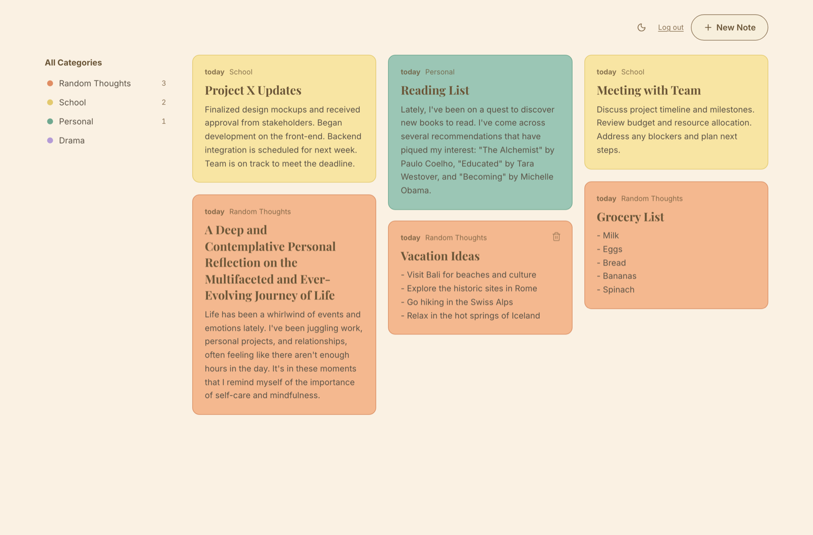
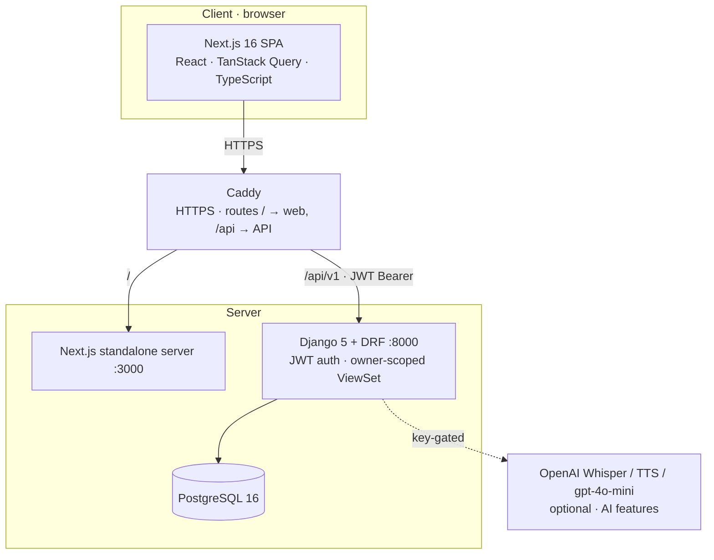
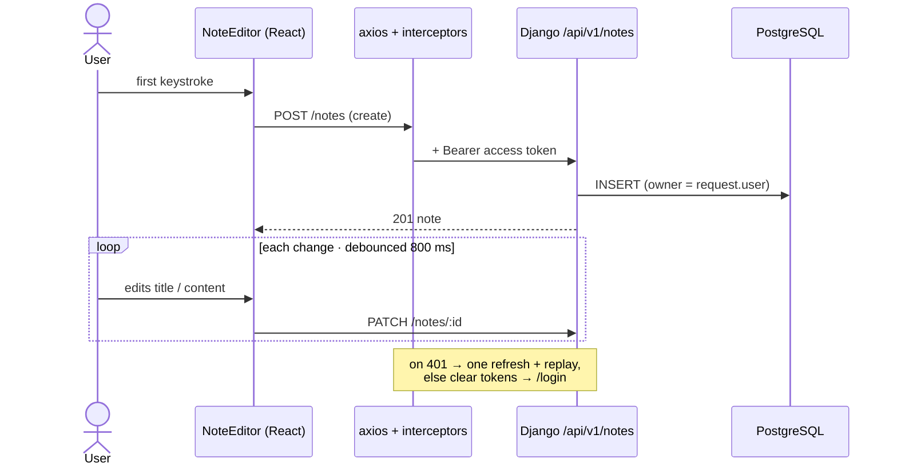
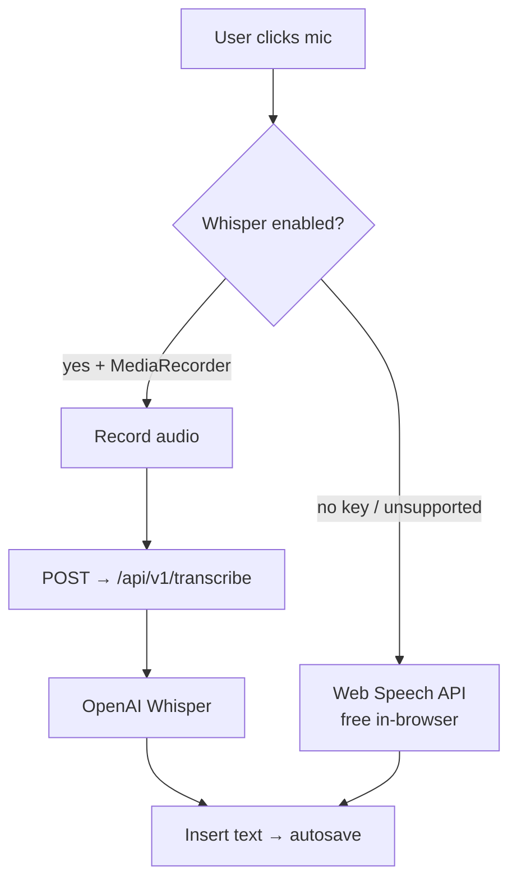
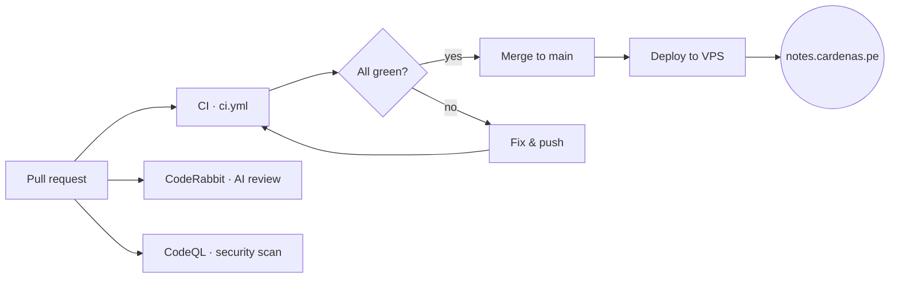

# Turbo Notes — Technical Overview

> A 5-minute technical tour: what it is, how it's built, and how to see it running.
> Companion to the full [README](../README.md).

---

## 1. What it is

A production-quality, per-user notes app built for the Turbo AI Senior Full Stack challenge — matched to the official prototype's cozy-journal design, with live AI voice features layered on top.

- **Backend** — Django 5 + DRF + PostgreSQL, JWT auth (simplejwt), owner-scoped data.
- **Frontend** — Next.js 16 (App Router) + TypeScript + TanStack Query, autosaving editor.
- **AI (live, optional)** — OpenAI Whisper (dictation), TTS (read-aloud), `gpt-4o-mini` (suggest title / summarize), and a hands-free **"close my note"** voice command — each degrades gracefully to free in-browser speech when no key is set.

**Guiding principle:** *the right amount of engineering for the scope* — clean layering, full test coverage, documented tradeoffs, no invented complexity.

---

## 2. Live demo

**🔴 [notes.cardenas.pe](https://notes.cardenas.pe)**

| | |
| --- | --- |
| **Login** | `demo@turbo.ai` / `demo12345` (backup `demo2@turbo.ai`) |
| **Try** | create a note (autosaves, no save button) · change its category (recolors instantly) · dictate by mic · read aloud · "suggest a title" / "summarize" |
| **Hands-free** | while dictating, say **"close my note"** → it strips the command, AI-names the note, and the editor evaporates closed |
| **Polish** | uniform card grid · the most-recent note carries a **"Latest"** highlight · dark mode · infinite scroll |

---

## 3. Architecture at a glance

**Layering.** Backend: idiomatic DRF (ViewSet + serializers + models) — ownership stamping in `perform_create`, scoping in `get_queryset`, no pass-through service layer it doesn't need. Frontend: pages wire state, components are presentational, all data access goes through `services/` (HTTP) → `hooks/` (cache) → `types/` (contracts), so it's mockable and unit-testable.

---

## 4. Two flows that show the design

**Autosave** — no save button; the note is born on the first keystroke and PATCHed on an 800 ms debounce, with a single transparent token refresh on 401.

**Voice → text** — AI is never a single point of failure or a forced cost.

---

## 5. CI/CD & quality

Every change ships through a pull request; nothing reaches production unless the pipeline is green.

- **CI gate** — backend (`flake8` · `black`/`isort` · `pytest` with an 85% coverage floor, currently **100%**) and frontend (`lint` · Jest · `next build`).
- **CodeRabbit** — free AI PR review. **CodeQL** — static security/quality scan (TS + Python). **Dependabot** — weekly dependency + security PRs.
- **Hardened deploy** — isolated Compose project on `127.0.0.1:3300`; idempotent Caddy wiring with `caddy validate` **before** reload (a bad edit never takes down neighbouring sites); post-deploy `/api/health` check; secrets only in GitHub Actions.

---

## 6. A note on the `k8s/` folder *(intentional, not in use)*

The repo includes Kubernetes manifests under `k8s/`. They are **documentation of the horizontal scale-out path, not the deployment in use.** At this scale the app runs as a single isolated Docker Compose stack behind a shared Caddy — which is the right size for the workload. The manifests exist to show the seam to Deployment + Service + HPA *if* traffic ever demanded it, without overbuilding today. See [Scalability considerations](../README.md#scalability-considerations).

This is deliberate: ship what the problem needs, document where it would grow.

---

## 7. Testing

- **Backend:** `pytest` + coverage, **100%** (floor enforced at 85% in CI). All OpenAI calls are mocked — tests need no key and no network.
- **Frontend:** Jest + React Testing Library, 100+ tests across components, hooks, services, and the voice-command logic.
- **Run it:** `docker compose up --build` (full stack), or see the [Quickstart](../README.md#quickstart).
